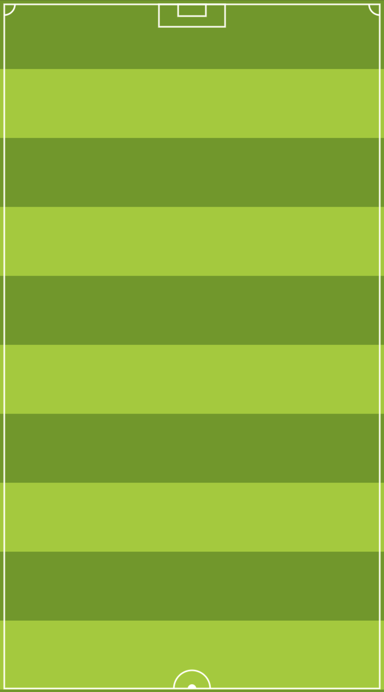

# CustomDrawable

Custom Images like above can be created by extending android Drawable class.

Need to create :
1. Custom class by extending Drawable class where we will draw the needed UI
2. Container where we will show above drawn class.
